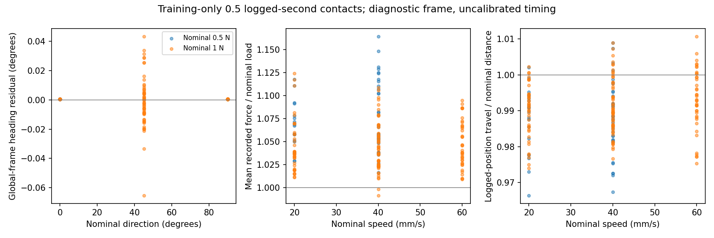

# Clock decision and contact QC review

Completed 9 October 2026. This closes the bounded clock investigation with an explicitly limited **logged-coordinate convention**. Physical acquisition timing remains unverified. The contact review extends diagnostics on training data; it does not freeze QC for the complete grid or change fitted models.

## Original CSV comparison

The [Figshare version-6 metadata](https://api.figshare.com/v2/articles/29438288/versions/6) identifies full archive file 61118716 (15,220,748,922 bytes). `audit_source_clock.py` read its ZIP directory and fifteen selected CSV members using exact HTTP ranges: **18,610,847 bytes**, below a 32 MiB cap. It fails if a server ignores a range, rejects oversized members, and verifies each member's ZIP CRC. The supplied whole-archive MD5 is recorded but **not verified**; no full archive was downloaded. Original CSVs remain in ignored local storage.

Five records were selected before reading originals, all on training specimen 0: `0_0_20_500_0`, `0_0_40_500_0`, `0_0_40_1000_1`, `0_90_40_500_0`, and `0_45_60_1000_1`. Acceleration, force, and position were compared against the pinned mirror. All fifteen have identical row counts, **zero nanosecond difference after rounding original seconds**, and **exact signal equality after float32 conversion**. Original acceleration/force mean logged row rates span **8,567.5–8,667.3 Hz**; position spans **99.976–100.051 Hz**. This rules out conversion as the cause for these selected records, not all recordings. See the [member comparison](clock_source_comparison.csv) and [range/hash provenance](clock_source_provenance.json).

The [paper](https://arxiv.org/html/2407.16206v4) describes roughly 6 kHz acceleration, 80 Hz force acquisition with 6 kHz transmission, 100 Hz position, and PC kernel-clock timestamps in separate acquisition threads. Thus PC clock precision alone does not establish each sample's acquisition time. The original files preserve the discrepancy; they do not explain it. The inspected [author repository snapshot](https://github.com/cluster-lab/Cluster-Haptic-Texture-Dataset/tree/e05d6b022d127e24f73583146f0aa229c6934449) contains analysis/viewer/preprocessing code, without an apparent acquisition/transport logger. Its [acceleration dataset loader](https://github.com/cluster-lab/Cluster-Haptic-Texture-Dataset/blob/e05d6b022d127e24f73583146f0aa229c6934449/train/datasets/accel_dataset_mel.py) resamples CSV timestamps; that is an analysis convention, not calibration evidence.

## Convention and claim scope

Use [logged_coordinates_v1](../configs/clock_convention.json) for continued development: preserve integer timestamps, select raw windows in logged seconds, interpolate/filter only their allowed samples, and resample to a computational 6,000-samples-per-logged-second grid. The implemented features and prior corrected runs already use this path. **No preparation algorithm, feature value, model, historical manifest, or QC threshold changes in this milestone.** The JSON records the interpretation; existing pipeline YAML remains the executable parameter source. These diagnostic scripts check that it agrees with the convention.

The labels 0.25/0.5/1 seconds refer to logged-time extents; the 24–1000 Hz band labels refer to inverse logged-time coordinates. Existing software fields ending in `_s` or `_hz` retain their names for compatibility. Report prediction quality and probe information under this declared convention. Do not claim calibrated physical contact duration, absolute vibration frequency, online onset detection, or force-law identification. Nominal speed/load remain requested conditions, not independently measured physical calibration.

The prior [timing sensitivity](timing_audit.md) and [corrected boundary report](window_boundary_report.md) remain relevant: alternate index timing changes budgets/features substantially. No predictor error was used to choose this convention. New acquisition evidence would reopen the decision through a versioned convention and fresh comparisons. Broader study design and scientific protocol freeze are still pending.

## Training contact diagnostics

The [review specification](../configs/qc_review.json) declares seven one-at-a-time variants around current settings. The script accesses **200 recording triplets / 600 hashed raw files**, ten training specimens, ten permitted conditions at 20/40/60 mm/s and 0/45/90 degrees, both repetitions. It never reads validation or training 30/50 mm/s recordings. All requested records enter the denominator, including short/excluded intervals; settings are not chosen by prediction scores.

| Setting | Valid records / requested | Full 0.5 logged-second interval | Full 1 logged-second interval |
| --- | --- | --- | --- |
| Current: 21 native position samples | 200 / 200 | 200 | 199 |
| 11 samples | 200 / 200 | 166 | 57 |
| 31 samples | 200 / 200 | 200 | 200 |
| Acceleration gap 0.005 or 0.02 s (current 0.01) | 200 / 200 each | 200 each | 199 each |
| Auxiliary gap 0.025 or 0.1 s (current 0.05) | 200 / 200 each | 200 each | 199 each |

The short current interval is `49_45_60_1000_0`: **0.819451 logged seconds**. Increasing smoothing retains it for one second, but retention alone does not justify a switch. The shorter smoother fragments usable runs substantially. Gaps are below even the tighter bounds in this selection; that does not establish full-grid robustness. Retain current settings while widening coverage review.

For each current interval, diagnostics examine the first **0.5 logged seconds from the steady start** (before acceleration-grid quantization). Position velocities use the same timestamp-aware local quadratic as existing speed QC; an equivalence test confirms identical speed magnitudes. Position smoothing is retrospective and may use neighboring position samples outside this diagnostic interval. These are offline review quantities, not additional prediction inputs or strict-budget measurements.

- **Heading:** one equal-record-weight global angle/sign fit gives `observed atan2(Y velocity, X velocity) ≈ −90.000484° − nominal heading`. Median absolute residual is **0.000484°**, 95th percentile **0.020041°**, maximum **0.065254°**. This is agreement with logged machine position on three headings, not independently tracked motion or proof of physical accuracy. No per-record correction or heading exclusion is introduced.
- **Loading:** time-weighted force/nominal ratio has median **1.04865** and range **0.99148–1.16433**. Median within-window force SD is **0.00486 N**; median absolute linear-trend change over 0.5 seconds is **0.01168 N** (95th percentile **0.04409 N**). Twenty-eight windows have effectively constant transmitted force values. Dense force rows are not independent 80 Hz measurements. The contact threshold checks contact presence, not exact nominal load; retain and disclose these deviations instead of filtering for favorable scores.
- **Travel:** integrated smoothed logged-position speed divided by nominal speed × duration has median **0.99062**, range **0.96645–1.01065**. Endpoint displacement is exported separately. This does not validate acceleration timing, scanned area, or physical distance; keep nominal-distance budget fields labeled nominal.



Exports: [record diagnostics](contact_qc_records.csv), [condition summaries](contact_qc_conditions.csv), [setting counts](contact_qc_sensitivity.csv), [every setting/record decision](contact_qc_sensitivity_records.csv), and [600 raw hashes, frame fit, source/output hashes](contact_qc_provenance.json). These are descriptives of a bounded training selection; crops and transmitted rows are not new independent specimens/trials.

## Reproduction and next gate

From the repository root, after the existing omitted-speed download (shared raw root):

```powershell
.\.venv\Scripts\python.exe scripts/audit_source_clock.py
.\.venv\Scripts\python.exe scripts/review_contact_qc.py
.\.venv\Scripts\python.exe -m pytest -q
```

The source script accesses the pinned original archive anew on each run and stores CSVs under `runs/clock_qc_review/source`; it only downloads bounded members. QC reads already cached pinned Parquet files and verifies their original inventory hashes. Compact derived tables/provenance and the figure are versioned; raw CSVs and Parquet are ignored. The 62-test suite covers bounded-range refusal, selected-member size/CRC handling, jitter-aware velocity equivalence, global heading recovery, endpoint interpolation, and known-motion/time-weighted force diagnostics alongside existing pipeline guards.

Next: complete metadata/exposure review, wider condition coverage and QC attrition, then repeatability, convergence, floor/range sensitivity, and specimen/condition errors. Specify matched-grid familiar/omitted comparisons before broader model fitting. All twelve previously inspected specimens remain development-exposed; no locked test or mechanics evaluation has been performed.
