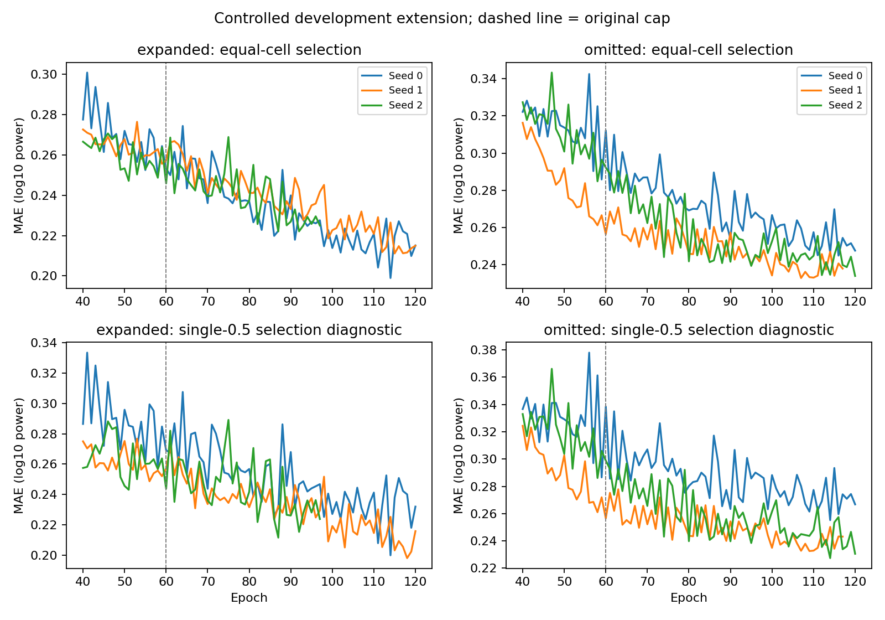

# Controlled bounded convergence extension

10 October 2026, America/Los_Angeles. Development evidence under [logged coordinates](../configs/clock_convention.json); two repeatedly used validation specimens, no fresh scientific test.

## Decision

The finite 120-epoch check is complete. All six fresh trajectories exactly reproduce the original first 60 training/selection losses, selected checkpoint tensors and validation predictions. Additional optimization improves familiar and known-speed selection scores, but **does not establish an encoder advantage**. Familiar retrieval still leads; omitted transfer log-power MAE becomes slightly worse while its modeled-band RMS error improves.

Adopt the [finite 120-epoch development policy](../configs/development_training_policy.json) for the next matched development fits, with unchanged architecture, optimizer, sampler, learning rate and patience. This is a bounded compute policy, **not proof of asymptotic convergence**: four runs still hit the cap, two stop through patience. Report that limitation without repeated cap increases or choosing the 60-epoch omitted checkpoint to rescue its known transfer MAE. Preserve both budgets and all baseline comparisons. Next complete prediction repetition reversal and residual review, then wider selection/transfer coverage and matched 70/44 fitting with common known-speed selection and 26 transfer triples. Scientific margins and test scoring remain unfrozen.

## Controlled inputs and access

The [prespecified review](../configs/convergence_review.json) retains the original ten training specimens and selection IDs 10/57, five protocols, three durations, fixed half-second query targets, raw windows, train-only scaler and original episode order. The historical configs and `training.py` remain unchanged. A new [training module](../src/tactile_contact/convergence.py) mirrors the original optimizer/sampler trajectory while adding primary-cell diagnostics and checkpoints available by epochs 60 and 120. Original roots and files are read only; outputs use `runs/convergence_120`.

The expanded familiar experiment retains its four original query triples, including fitting/selection at 30/50 mm/s. The omitted experiment retains six 20/40/60 fitting/selection triples and four 30/50 transfer triples. These remain different query grids; their scores do not isolate the effect of withholding speed. The later matched comparison is a separate experiment with common known-speed selection.

Reservation/exposure preflight runs before feature values. Historical manifest/source hashes, cohort/configuration identity, original selection domains and exact training-scaler reconstruction are checked. A feature whitelist rejects every omitted transfer target before loading or returning cached values. All **six** trajectories and their exact reference checks are completed, and a hashed `selection_complete.json` is saved, **before** transfer targets, historical prediction arrays or baseline scores are read. No reserved specimen or new raw recording is accessed. Twenty reserved specimens remain metadata-only.

Unchanged baseline scores/arrays are reused after the selection seal because their fitting pools, targets, support budgets and selected parameters are unchanged. They are not newly refitted. New correct/wrong-support predictions and scores are saved at both budgets, with historical target/episode identity verified. All five baselines remain in the full tables.

## Exact reproduction and stop reasons

The first-60 histories have maximum numerical difference **0.0** across all six runs. Selected checkpoint tensors and predicted arrays are exactly equal to their historical references, not merely close. The primary single-0.5 history is now saved at every epoch; it remains diagnostic and does not replace equal-cell selection. The six runs save **694 epoch rows** in total.

| Experiment / seed | Epochs run | Stop | Selected by 60 | Selected by 120 | Equal-cell selection MAE: 60 → 120 |
| --- | --- | --- | --- | --- | --- |
| Expanded / 0 | 120 | Cap | 58 | 114 | 0.249650 → 0.198963 |
| Expanded / 1 | 120 | Cap | 59 | 115 | 0.255631 → 0.211158 |
| Expanded / 2 | 97 | Patience | 60 | 87 | 0.245874 → 0.222093 |
| Omitted / 0 | 120 | Cap | 59 | 116 | 0.285800 → 0.244829 |
| Omitted / 1 | 117 | Patience | 60 | 107 | 0.256340 → 0.232777 |
| Omitted / 2 | 120 | Cap | 58 | 120 | 0.284821 → 0.233894 |

“By 120” means the best equal-cell checkpoint available under that cap, including earlier patience stops. It does not force every seed to train for 120 epochs. The four cap-limited trajectories still improve their best scores in the last ten epochs; the two patience stops have no new best in that interval. Patience is ten epochs without a strictly improved equal-cell score.



The figure displays epochs 40 onward; all epoch rows are exported. Dashed lines mark the historical cap. Primary and aggregate scores can differ, and neither is calibrated physical force/motion error. Checkpoints are selected weights, marked non-resumable; the extension starts fresh rather than resuming without optimizer/sampler state.

## Primary model and amplitude results

Single 0.5 logged-second support, mean queries within specimen, mean seeds within specimen, then equal specimens. These are two development validation groups, not a scientific test. Familiar scores are selection; omitted 30/50 scores are transfer after all choices are sealed.

| Experiment / partition | Retrieval MAE | Fixed-feature MAE | Encoder by 60 | Encoder by 120 | Interpretation |
| --- | --- | --- | --- | --- | --- |
| Expanded familiar selection | **0.172648** | 0.201606 | 0.251252 | 0.204909 | Optimization helps; retrieval still leads, fixed features slightly lower than encoder |
| Omitted known-speed selection | **0.156301** | 0.242826 | 0.276382 | 0.241005 | Selection improves; retrieval remains substantially lower |
| Omitted 30/50 transfer | 0.329951 | **0.309587** | 0.314145 | 0.324545 | Transfer log-power MAE worsens; no encoder advantage established |

| Modeled-band total RMS error | Retrieval | Fixed features | Encoder by 60 | Encoder by 120 |
| --- | --- | --- | --- | --- |
| Expanded selection | **0.120226** | 0.213699 | 0.273321 | 0.224765 |
| Omitted known-speed selection | **0.094997** | 0.344378 | 0.474490 | 0.355614 |
| Omitted transfer | **0.759809** | 0.835540 | 0.919078 | 0.803408 |

RMS error uses acceleration units derived from SI conversion and the declared computational bands; it is not total physical acceleration over all frequencies. Log-power and RMS can favor different methods. Wrong support still worsens the latest encoder: expanded MAE **0.567925** versus 0.204909; omitted transfer **0.531298** versus 0.324545. This supports specimen-dependent conditioning within development, not intrinsic material identification.

The paired expanded 60-minus-120 primary MAE improvement is **0.046343**, with a two-group descriptive interval [0.040667, 0.052020]. Omitted transfer improvement is **−0.010400**, interval [−0.023213, 0.002413]. Retrieval-minus-latest-encoder omitted transfer is **0.005406**, interval [−0.025886, 0.036698], still inconclusive. These intervals summarize two development groups and cannot establish scientific uncertainty or equivalence. A more favorable metric or epoch must not redefine the retained primary comparison.

## Reproduction and evidence

After reconstructing the two corrected historical runs and their recorded environment, from the repository root:

```powershell
.\.venv\Scripts\python.exe scripts/review_convergence.py
.\.venv\Scripts\python.exe -m pytest -q
```

The default output root must be absent. The runner refuses overwrite rather than mixing trajectories. For another explicit reconstruction, copy the review config, change only `output_root` to a new ignored path, and pass it with `--review`; retain all scientific controls. Missing/hash-mismatched historical inputs or any reference reproduction failure stop the review. A clean clone needs the pinned raw data, corrected preparation, saved historical histories/checkpoints and their recorded source/environment; public aggregates alone are insufficient.

Exports: [694 epoch histories](convergence_review_histories.csv), [six selections and stop reasons](convergence_review_selections.csv), [full method/protocol/duration/partition summary](convergence_review_summary.csv), [seed-averaged specimen scores](convergence_review_per_surface.csv), [paired diagnostics](convergence_review_paired.csv), [source/input/feature/scoring/selection provenance](convergence_review_provenance.json). Full new checkpoints, predictions, per-query scores, environment lock and the selection seal remain local/ignored. The report records development policy separately from the executed review config, so later policy decisions do not alter the run's input hash.

Seven new convergence/access checks bring the suite to **85 passing tests** (74.31 seconds), with compilation and release link/hash checks. Historical boundary/diagnostic evidence, original supplied documents and raw data remain preserved. Clock calibration, fabrication-family independence, fresh scientific scoring and mechanics/control validation remain uncompleted.
