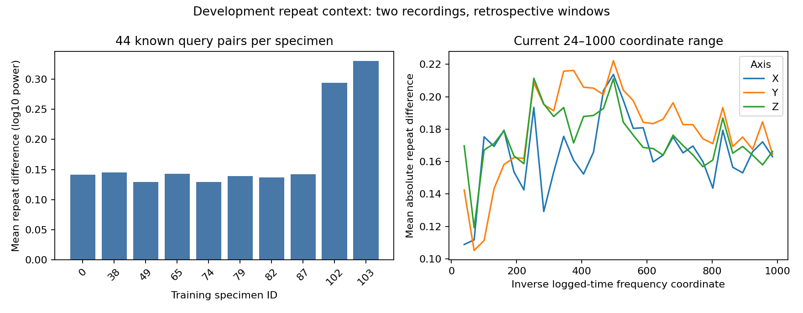
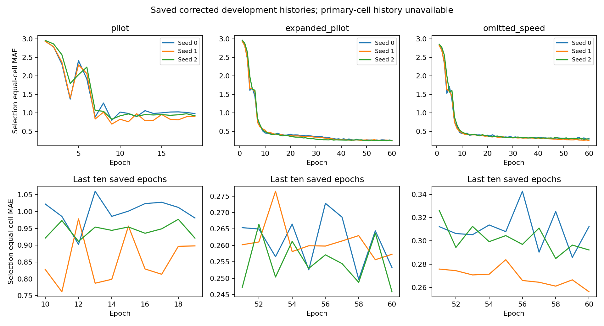

# Training repeat, feature and convergence review

9 October 2026, America/Los_Angeles. Development diagnostics under the declared [logged-coordinate convention](../configs/clock_convention.json); no new models or scientific test scores.

**Subsequent milestone, 10 October:** the proposed finite extension below has now been [completed](convergence_review_report.md), with exact first-60 reproduction and saved primary histories. This report preserves the earlier training-diagnostic findings and proposal; use the newer report for 120-cap model results and current next steps.

## Decision

Retain current QC, the 32 × 3 features over 24–1000 inverse logged-time coordinates, and the numerical floor `1e-10`. The floor is negligible on the reviewed training data, and changing the range changes the prediction target rather than establishing a better predictor. Repeat differences are substantial and vary by specimen. **Convergence remains unresolved:** all six expanded/omitted encoder trajectories reach the 60-epoch cap and improve in their last ten epochs. Complete a controlled convergence extension with primary-cell logging before broader fitting and a scientific freeze. Preserve the existing negative/inconclusive model comparisons.

## Access and windows

The [prespecified diagnostic settings](../configs/development_diagnostics.json) review all **960** previously audited known-speed training records: ten existing training specimens × 48 conditions × two recordings. Each uses its own first 0.5 logged seconds after current retrospective steady-interval selection, rounded to the same acceleration output grid as the existing pipeline. Raw acceleration is cropped before interpolation/filtering, and all processing dependencies remain inside that window. This rounding can differ slightly from the unrounded motion/load diagnostic window in the earlier QC report.

Reservation preflight runs before source or sensor access. Exact specimen/condition/repeat identities, complete denominators, the QC settings/report, and all **2,880** raw channel hashes are checked. No selection, training omitted-speed, or reserved signals are read. Saved histories and checkpoint metadata are separately read for the twelve already exposed development specimens; this does not read their response signals again. The twenty reserved specimens remain metadata-only.

There are **480 repeat pairs**, of which **440** are known query pairs after the four support conditions are excluded. Both recordings remain in the same condition/specimen pair. The mean averages the 96 absolute log-feature differences within a pair, then query conditions within each specimen, then specimens equally. There are ten development specimens, with metadata-only family uncertainty; neither 440 pairs nor 96 features constitute that many independent materials.

## Repeat context

| Current 24–1000 feature diagnostic | Result |
| --- | --- |
| Equal-specimen mean query repeat MAE | **0.172972 log10-power units** |
| Query pair median; 5th–95th percentiles | 0.136010; 0.099449–0.292508 |
| Mean symmetric modeled-band RMS difference | **10.779%** |
| Specimens 102 / 103: mean query repeat MAE | **0.293568 / 0.329806** |
| Other eight specimens: mean query repeat MAE range | 0.129072–0.145044 |

Symmetric RMS difference is `2*abs(rms_0-rms_1)/(rms_0+rms_1)`, with zero for two zero responses. RMS integrates only the declared band range. Specimens 102/103 also have mean symmetric RMS differences of 31.887%/29.092%. Retain them in every required denominator; elevated variability is a reason for failure analysis, not a favorable-score exclusion.



These are two independently recorded scans, selected retrospectively and not aligned to the same spatial segment. Their differences can include surface heterogeneity, contact/mounting changes, motion/load differences and apparatus signals. **They are neither a calibrated sensor noise floor nor a strict irreducible prediction-error bound.** A predictor could estimate a more stable conditional mean. The numerical similarity between this mean and historical retrieval MAE does not establish noise-limited retrieval: the specimens, query grids and averaging contexts differ. Reversing support/query repetition in matched prediction experiments remains a separate pending check.

## Numerical floor and range

All **92,160** current band/axis values exceed even the largest diagnostic floor `1e-8`. Minimum band powers by axis are X `1.9421e-5`, Y `2.3968e-5`, Z `3.4963e-5` in `(m/s²)²` under the logged-coordinate calculation. The floor is numerical, not an instrument noise estimate.

| Alternative floor | Largest feature change from `1e-10` | Largest axis mean feature change |
| --- | --- | --- |
| `1e-12` | 0.000002214 | 0.000000176 |
| `1e-8` | 0.000221326 | 0.000017640 |

This small training feature sensitivity supports retaining `1e-10`; it does not verify future specimens or unchanged model scores under refitting. No model was fitted to an alternative floor.

The range check reuses each prepared window's full Welch PSD and the same bin-center integration. Each alternative has 32 linear bands and three axes; wider ranges produce wider bands and different averaging. Power fraction divides range power by the same full computational PSD power from 24 through Nyquist (3000 inverse logged-time units).

| Range | Mean query repeat MAE | Median fraction of 24–Nyquist power | 5th-percentile fraction |
| --- | --- | --- | --- |
| 24–500 | 0.204781 | 96.538% | 67.104% |
| Current 24–1000 | **0.172972** | **98.376%** | **84.531%** |
| 24–1500 | 0.149789 | 99.158% | 91.152% |

The wider feature's lower repeat difference is not evidence of greater predictive usefulness: band widths, integrated power and the target change. Median concentration also hides conditions with more power outside the range. Full PSD origin and physical frequency remain uncalibrated. Keep the existing range; inspect the exported axis/band and condition tables in future residual analysis rather than choosing a range for a lower error.

## Saved convergence evidence

Nine corrected-run histories and checkpoint selections were reviewed. The initial single-probe pilot's three trajectories stop after epoch 19 with epoch 9 selected. Expanded/omitted histories each run all 60 epochs, selecting epochs 58–60. Their last-ten-epoch best-score improvements are measured relative to the best equal-cell selection score in epochs 1–50:

| Corrected run | Seeds | Selected epochs | Relative improvement during final ten epochs |
| --- | --- | --- | --- |
| Initial pilot | 0 / 1 / 2 | 9 / 9 / 9 | 0% each; patience stop |
| Expanded pilot | 0 / 1 / 2 | 58 / 59 / 60 | 3.198% / 1.439% / 2.696% |
| Omitted-speed | 0 / 1 / 2 | 59 / 60 / 58 | 7.461% / 9.402% / 5.319% |



The histories contain training loss and equal-cell selection MAE; **primary single-0.5-cell history was not saved** and cannot be reconstructed from selected checkpoints alone. These curves support a finite convergence check, not a claim that extra training will beat retrieval. Omitted-speed histories use known-speed selection only. No transfer score was used for this diagnostic or an extension choice.

## Practical scale and next action

A hypothetical `0.01` change in mean log-power MAE is about **5.8%** of this training repeat context. For a single uniformly shifted band, `0.01`/`0.02` log10-power units correspond to power ratios of approximately 1.0233/1.0471; mean absolute feature error is not itself a uniform power-ratio error. These scales help describe a proposed effect but do not establish physical utility or equivalence. A scientific practical margin remains unfrozen while convergence, repetition reversal and matched development residuals are unresolved. Do not convert a two-specimen inconclusive interval into an equivalence claim.

The next controlled check should freshly train the unchanged expanded and omitted cohorts with the same three seeds, optimizer, balancing, learning rate, patience and original experiment-specific selection domains/equal-cell rule, with a finite **120-epoch cap**. Expanded familiar selection retains its four original query triples, including 30/50 mm/s; omitted-speed selection retains only its six 20/40/60 triples. Save equal-cell and primary single-0.5 selection histories, the best checkpoints available by epochs 60 and 120, and actual stop reasons. Check reproduction of the original first-60 histories before interpreting the extension. Preserve old roots and source hashes; do not resume a weights-only checkpoint without optimizer/sampler state. If the larger cap still binds, report it rather than repeatedly increasing it to pursue a model victory. Final selections must precede any new transfer-target scoring. At the time of the 10 October selection-domain clarification, the extension had not run; the subsequent completed result is linked at the start of this report.

Then complete repetition reversal, wider selection/transfer coverage and matched 70-versus-44 fitting with common known-speed selection and the same 26 transfer triples. Freeze practical/secondary policies and scientific access only after these modest development decisions. Hardware calibration remains a separate gate.

## Reproduction and evidence

From the repository root, after the wider QC audit and the three corrected development runs:

```powershell
.\.venv\Scripts\python.exe scripts/review_development_diagnostics.py
.\.venv\Scripts\python.exe -m pytest -q
```

Exports: [960 bounded windows](development_diagnostics_windows.csv), [paired diagnostics for all three ranges](development_diagnostics_repeat_pairs.csv), [specimens](development_diagnostics_repeat_surfaces.csv), [44 query conditions](development_diagnostics_repeat_conditions.csv), [axis/band scales](development_diagnostics_bands.csv), [floor sensitivity](development_diagnostics_floor.csv), [range sensitivity](development_diagnostics_range.csv), [checkpoint/history review](development_diagnostics_history.csv), [learning curves](development_diagnostics_learning_curves.csv), [compact summary](development_diagnostics_summary.json) and [raw/source/input/output hashes](development_diagnostics_provenance.json).

Raw data, full checkpoints and feature arrays remain ignored by Git. Public aggregates alone do not reproduce the review: reconstruction requires the pinned raw subset, QC audit and corrected historical runs with their recorded source/environment. No historical result or fitted model was overwritten. Eight new analytical/access checks bring the suite to **78 passing tests** (33.41 seconds), with compilation and report/link/hash validation also checked before publication.
