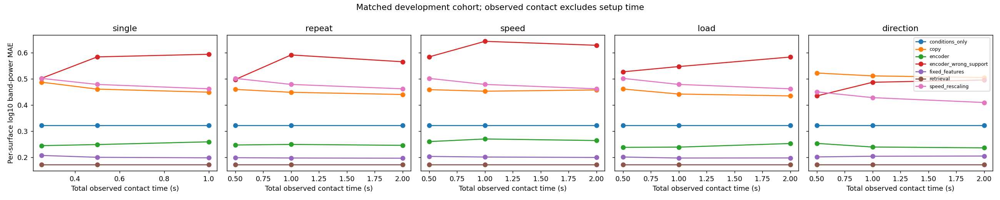

# Expanded development pilot — 8 October 2026

**Correction completed 9 October:** the [bounded rerun report](window_boundary_report.md) now documents the fixed raw-window preparation and matched comparisons. The original scores and provenance below remain historical.

**Later reassessment:** scores and provenance below are preserved from this historical run. Whole-record interpolation/filtering occurs before support cropping, so outside-window raw acceleration can affect features; the amount is unquantified. Duration labels are provisional, and recorded distance is nominal speed times duration. Strict information-budget claims require corrected bounded preparation and aligned reruns. Timing and fresh-test gates remain open; see the [revised plan](research_plan.md).

The expanded pipeline completed five support protocols and 0.25/0.5/1-second observations on the original ten training and two development validation specimens. All 192 recordings passed QC. Preparation produced 268 windows and 1,320 episodes (1,200 training, 120 validation). Four distinct query conditions per specimen remain fixed across every method and protocol; validation uses repeat 1. These are development results, with no locked test evaluated.

## Primary development cell

Single 0.5-second support; per-query error averaged within each specimen and then across the two specimens. Encoder rows average the three initialization seeds within specimen. Lower values are better.

| Method | Log10 band-power MAE | Modeled-band RMS error (m/s²) |
| --- | ---: | ---: |
| retrieval | 0.1724 | 0.1203 |
| fixed_features | 0.2006 | 0.2132 |
| encoder | 0.2492 | 0.2819 |
| conditions_only | 0.3225 | 0.3124 |
| copy | 0.4607 | 0.6217 |
| speed_rescaling | 0.4787 | 0.5825 |
| encoder_wrong_support | 0.5837 | 0.3534 |

The encoder improves on the initial pilot's approximately 0.791 MAE, but retrieval and fixed-feature regression remain stronger. Expanded training samples cover multiple cells and early stopping selects later epochs, so this change does not isolate the effect of any single probe. Wrong-surface support now increases encoder error substantially. That is evidence of surface dependence within this tiny development cohort; it does not establish a generalization advantage.

## Matched budgets and probe choice

The exports compare single 1-second contact against two 0.5-second contacts, single 0.5-second contact against two 0.25-second contacts, and repetition against alternative second probes at 0.5 seconds per contact. Query identities are checked before pairing. Declared observation time and nominal sliding distance are recorded; setup and repositioning are excluded.

| Method | Repeat 2×0.5 s | Direction 2×0.5 s | Speed 2×0.5 s | Load 2×0.5 s |
| --- | ---: | ---: | ---: | ---: |
| retrieval | 0.1724 | 0.1724 | 0.1724 | 0.1724 |
| fixed_features | 0.1979 | 0.2046 | 0.2016 | 0.1978 |
| encoder | 0.2497 | 0.2398 | 0.2705 | 0.2394 |

Retrieval selects the same training specimen for each held-out specimen across all tested budgets, producing the same response predictions. The encoder favors direction over repetition in this pilot, while fixed-feature regression shows little change. Two specimens and four query conditions cannot establish a preferred probe scientifically. Longer support does not consistently lower every method's error. All contrasts and bootstrap intervals are retained as provisional diagnostics rather than equivalence or significance claims.

## Fitting and diagnostic limits

Fixed-feature regression uses mean/std of permitted support vectors, count, and requested conditions; five declared ridge candidates select alpha 1 on development validation. Both support-feature scaling and regression-feature scaling fit training observations only. Regression sample weights total one per specimen, so duplicating query labels across cells does not change regularization strength.

Direction-agnostic rescaling uses the full support PSD and `s^(p-1) r^b S(f/s)`. Above-floor training band powers fit global speed/load exponents; three ridge candidates select alpha 1, p=0.1553, b=0.3798 on validation. These are empirical development parameters, not verified material laws. Source-frequency extrapolation is rejected. The support-selection rule prioritizes angle, speed ratio, then protocol order; unused contacts do not automatically improve this baseline.

Named diagnostics score every method on same-direction queries, protocol-specific unobserved directions/loads, and the common unobserved-direction intersection. Condition lists and sample counts are saved. These are familiar-condition experiments; 30/50 mm/s labels were used in fitting, so they are not an omitted-speed test.

The training-only clock sensitivity covers 230 windows: median nominal index/logged duration ratio 1.4388, median feature MAE 0.3526. See the [timing audit](timing_audit.md). The [specimen review](specimen_group_audit.md) covers available names; fabrication-family independence remains unresolved.

## Reproduction and next work

Commands and isolated output roots are in the [README](../README.md). Versioned aggregate exports: [full method matrix](expanded_pilot_summary.csv), [budget contrasts](expanded_pilot_budget_contrasts.csv), [named subsets](expanded_pilot_diagnostic_subsets.csv), and [run provenance](expanded_pilot_provenance.json). Raw predictions, per-specimen errors, checkpoints, raw-file hashes, and environment lock remain in the local run directory.

Next: establish timing, complete the family review, broaden the common query grid, then refit a separate globally omitted-speed experiment. Preserve these pilot outcomes while investigating the encoder gap. Mechanical identification, simulation, and control have not begun.
