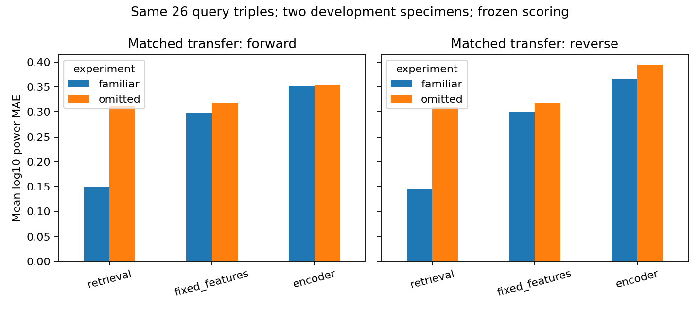

# Matched familiar / omitted-speed development — 10 October 2026

The same 26 transfer query triples are now compared after fitting on **70 familiar** versus **44 known-speed** query triples. Removing the transfer-speed training responses substantially worsens retrieval, while the encoder changes little in the forward orientation and remains behind the strongest baselines. This is a development comparison on two repeatedly exposed specimens, without a locked scientific test or a population significance claim.

## Roles and fixed budgets

The [execution specification](../configs/matched_fit_review.json) implements the preserved [prepared design](../configs/matched_development_review.json). Training specimens are 0/38/49/65/74/79/82/87/102/103; shared selection/scoring specimens are 10/57. Both training query repetitions are used. Original training supports, five protocols, support durations 0.25/0.5/1 and fixed 0.5 query targets are unchanged. Durations and frequency labels follow [logged_coordinates_v1](../configs/clock_convention.json); physical timing remains unverified.

The [training coverage audit](transfer_training_coverage_review.md) adds 520 safe transfer-speed triplets to 960 known-speed records. All required training cells survive at every support budget. The [validation audit](selection_transfer_coverage_review.md) similarly retains every required 44 known-speed and 26 safe transfer condition on both specimens and repetitions. Six transfer triples without permitted retrieval endpoints remain excluded. QC, spectral features, floor, architecture and finite [120-cap policy](../configs/development_training_policy.json) are unchanged.

Each experiment refits all five baselines and three encoder seeds separately. The shared train-only scaler uses exactly the same 150 support windows, with identical statistics. Familiar training has **21,000** episodes; omitted training has **13,200**. Both select on **1,320** forward known-speed episodes. Both score the same **4,200** episodes: 2,100 per orientation, each comprising 1,320 known-speed and 780 transfer episodes. Episode counts are repeated conditions/budgets, not independent specimens.

## Results

Raw log10 band-power MAE, single 0.5 support; queries average within specimen, seeds within specimen, then specimens equally. Lower is better.

| Shared scoring domain | Orientation | Familiar retrieval | Omitted retrieval | Familiar fixed features | Omitted fixed features | Familiar encoder | Omitted encoder |
| --- | --- | ---: | ---: | ---: | ---: | ---: | ---: |
| Known-speed 44 | Forward | 0.157480 | 0.157480 | 0.316785 | 0.312214 | 0.358985 | 0.345186 |
| Known-speed 44 | Reverse | 0.153866 | 0.153866 | 0.311432 | 0.306780 | 0.382472 | 0.394519 |
| Transfer-speed 26 | Forward | **0.149374** | **0.311900** | 0.298727 | 0.318800 | 0.351728 | 0.354996 |
| Transfer-speed 26 | Reverse | **0.146161** | **0.308938** | 0.300449 | 0.317804 | 0.365812 | 0.395250 |

Withholding transfer-speed responses increases retrieval transfer MAE by **0.162526 forward / 0.162777 reverse**, fixed-feature MAE by 0.020073 / 0.017355 and encoder MAE by 0.003268 / 0.029439. Known-speed retrieval is identical between fits, as expected from its retained same-condition library. The intended treatment changes the number of training query conditions as well as speed coverage; it does not isolate speed information at equal training sample count. The large retrieval change establishes sensitivity to available library responses on this grid, not universal speed generalization.

Encoder wrong-support transfer MAE is 0.602685 / 0.575230 for familiar forward/reverse and 0.619069 / 0.605467 for omitted forward/reverse: the fitted encoder uses specimen support information, but that does not establish superiority. Modeled-band total RMS errors for forward transfer are familiar retrieval/fixed/encoder **0.112190 / 0.775300 / 0.837558**, and omitted **0.576183 / 0.781177 / 0.821817**. Omitted encoder RMS improves relative to familiar despite worse log-power MAE. Retain both metrics and both orientations.

The main probe-choice contrast is repeat MAE minus direction MAE at two 0.5 contacts; positive favors direction. Encoder contrasts are familiar known-speed **+0.008073 forward / +0.002096 reverse**, familiar transfer **+0.000259 / −0.002334**, omitted known-speed **+0.012677 / −0.001461**, and omitted transfer **+0.002580 / −0.005711**. Transfer contrasts reverse sign and their two-group intervals include zero. No stable direction benefit is established. Reverse scoring changes both supports and query repetition, so it does not isolate a support-only effect. Retrieval's repeat/direction differences are zero in this run.

The [primary residual table](matched_review_primary_residuals.csv) retains all specimen/condition cells for single, repeat and direction at 0.5. Forward transfer encoder MAE on specimens 10/57 is familiar **0.321303 / 0.382153** and omitted **0.324233 / 0.385760**; reverse is familiar **0.376915 / 0.354708** and omitted **0.421282 / 0.369219**. Averaging specimens, encoder transfer errors at 30/50 are familiar forward **0.300137 / 0.403318** and omitted **0.308960 / 0.401033**. Retain every specimen/condition and report this heterogeneity without selecting exclusions or new features from errors.



## Finite training and access evidence

| Fit | Seed | Selected epoch | Epochs run | Stop reason |
| --- | ---: | ---: | ---: | --- |
| Familiar | 0 | 31 | 41 | Patience |
| Familiar | 1 | 114 | 120 | Epoch cap |
| Familiar | 2 | 58 | 68 | Patience |
| Omitted | 0 | 59 | 69 | Patience |
| Omitted | 1 | 116 | 120 | Epoch cap |
| Omitted | 2 | 36 | 46 | Patience |

Every checkpoint is selected by equal protocol/duration-cell known-speed validation MAE; single-0.5 histories are diagnostic only. Two trajectories remain cap-limited. Preserve the finite cap and seed variation; this run does not establish optimization convergence or justify another cap increase.

Reservation preflight precedes signal access. The new feature store rejects cached scoring targets during fitting/selection and rejects all omitted training 30/50 responses. **192** validation target windows—104 transfer plus 88 reverse known-speed—are prepared only after all **ten baseline / six encoder** selections across both experiments are sealed. The complete 1,878-window feature audit verifies raw dependency hashes and bit-for-bit invariance to outside-interval acceleration. Completed output roots reject overwrite. Raw data, checkpoints, full predictions, retrieval sources and 92,400 per-query score rows remain ignored; derived tables and hash provenance are public. All twenty reserved specimens remain untouched.

**110 tests pass**, including ten matched-role, target/cache isolation, finite-history, missing-cell, orientation and reservation checks. The release validator independently verifies input/source/selected artifact hashes, shared episode identities/scaler, the selection seal, access logs, target reconstruction and public score aggregates. Earlier reversal and validation coverage validators still pass.

Run from the repository root after the coverage prerequisites:

```powershell
.venv/Scripts/python.exe scripts/review_transfer_training_coverage.py --download
.venv/Scripts/python.exe scripts/run_matched_development.py
.venv/Scripts/python.exe scripts/validate_matched_review.py
```

Reconstruction requires explicit copied configurations with new output roots and the recorded source/environment; existing roots are preserved. The coverage runner depends on the earlier wider known-speed audit and original bounded sources. See [provenance](matched_review_provenance.json), [all-cell summary](matched_review_summary.csv), [per-specimen scores](matched_review_per_surface.csv), [contrasts](matched_review_contrasts.csv), [selections](matched_review_selections.csv), [histories](matched_review_histories.csv) and [window audit](matched_review_windows.csv).

## Next decision

The subsequent [independent validation](matched_validation_review.md) reproduces every frozen prediction array, raw feature and published score/contrast, with no numerical result change. It adds repeatable verification scripts and separate proofs while preserving this execution and all reserved specimens.

Keep all methods, specimens, QC, features and declared primary comparisons. Record a justified practical-effect margin and descriptive secondary-analysis policy, then freeze the intended scientific cohort, full 76-query familiar coverage and test access/scoring contract. Implement and verify scoring with frozen fits before accessing reserved test signals. The completed 70/44 comparison is a restricted developmental treatment comparison; it does not complete the broader 76-query familiar primary study. The two validation groups cannot establish manufacturing-family independence, population significance, calibrated timing or mechanical identification.
