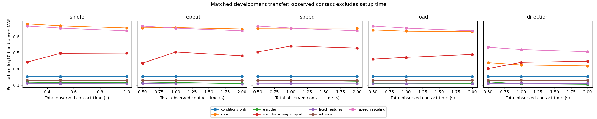

# Globally omitted-speed development experiment — 8 October 2026

**Correction completed 9 October:** the [bounded rerun report](window_boundary_report.md) now documents the fixed raw-window preparation and matched comparisons. The original scores and provenance below remain historical.

**Later reassessment:** this report preserves its original scores and run provenance. Whole-record interpolation/filtering before support cropping can use outside-budget raw acceleration; its feature effect is unquantified. Strict duration claims require bounded preparation and aligned reruns, and physical timing remains unresolved. All 12 specimens stay development-exposed. Full-grid scope would be 44 permitted-speed triples and 26 endpoint-safe transfer triples out of 32 before QC; a matched-grid familiar comparator is still pending. See the [revised plan](research_plan.md) and [guide](implementation_guide.md).

This experiment refits every learned comparator using 20/40/60 mm/s responses only. Those same permitted speeds select regularization and encoder checkpoints on development validation specimens. The 30/50 mm/s targets are read for scoring only after all methods and all three checkpoints are selected. This is a new-condition development evaluation on the existing validation specimens, not a locked scientific test.

## Coverage and data separation

The bounded selection verified 770 raw files (91.9 MB). All 256 requested recordings passed the current QC rules. Preparation produced 320 windows and 2,100 episodes: 1,800 fitting, 180 selection, and 120 transfer. All ten training and two validation specimens remain eligible across five protocols and three durations.

Permitted response conditions are 20/40/60 mm/s × 45/90 degrees × nominal 1 N. Transfer conditions are 30/50 mm/s × those same directions/load. Support protocols are unchanged. The angular/load cells supply permitted bracketing responses outside the union of excluded support conditions; the earlier pilot's 0-degree/0.5 N query cells would need excluded response endpoints under this contract. Results therefore cannot be compared directly with the earlier pilot's four-condition MAE as though only speed withholding changed.

The downloader, audit, and extractor exclude omitted-speed training records, including any such files left in a shared raw cache. Scalers, conditions-only fitting, fixed-feature fitting, exponent fitting, retrieval libraries, and checkpoint selection reject transfer episodes. Episode manifests label `fit`, `selection`, and `transfer` explicitly. Selection and transfer metrics/budget contrasts are exported separately.

## Primary development result

Single 0.5-second support. Errors average within specimen, then across specimens; encoder errors average the three seeds within specimen. Selection conditions and transfer conditions differ, and selection scores were used in tuning.

| Method | Permitted-speed selection MAE | Omitted-speed transfer MAE | Transfer RMS error (m/s²) |
| --- | ---: | ---: | ---: |
| fixed_features | 0.2423 | 0.3098 | 0.8377 |
| encoder | 0.2794 | 0.3158 | 0.9431 |
| retrieval | 0.1558 | 0.3298 | 0.7595 |
| conditions_only | 0.3053 | 0.3545 | 0.8932 |
| encoder_wrong_support | 0.4517 | 0.4975 | 0.9645 |
| speed_rescaling | 0.6442 | 0.6536 | 1.2073 |
| copy | 0.6785 | 0.6678 | 1.2993 |

Fixed-feature regression has the lowest transfer log-power MAE in this cell. The encoder narrowly beats interpolated retrieval on that metric, while retrieval has lower transfer RMS error. Neither supports a general learned-model advantage from this development cohort.

The paired retrieval-minus-encoder log-power difference is 0.0140; the two-group bootstrap interval is [-0.0028, 0.0307]. It includes zero and is retained as a small-cohort diagnostic. Wrong support increases encoder transfer MAE, consistent with surface-dependent predictions within these specimens.

## Retrieval and matched budgets

For each of the 120 transfer episodes, retrieval selects a training specimen from permitted support, then interpolates its log band powers between 20/40 mm/s for a 30 mm/s query or 40/60 mm/s for a 50 mm/s query. Both endpoints use the same direction and nominal load; both training response repeats are averaged in linear power before taking logs. Each interpolation weight is 0.5. No omitted-speed response is stored or read by the retrieval fit. Prediction provenance retains exact endpoint window IDs and weights.

All protocols and durations use the same eligible specimens and query conditions within each partition. Equal-time comparisons and repeat/direction/speed/load contrasts are reported in the exported tables. The full matrix remains necessary when interpreting probe choice; the primary cell is not selected from favorable budgets.

## Remaining limitations and reproduction

Timing remains provisional. The training-only comparison of 270 windows gives a median acquisition-index/logged duration ratio of 1.4400, and median band-log-power difference 0.3915. Available names have been reviewed, but manufacturing-family independence is unresolved. Nominal 1 N and two query directions are a limited development grid.

The original pilot and expanded familiar-condition results remain preserved. Reproduction commands are in the [README](../README.md). Versioned outputs include the [full matrix](omitted_speed_summary.csv), [transfer budget contrasts](omitted_speed_transfer_budget_contrasts.csv), [transfer conditions](omitted_speed_transfer_diagnostic_conditions.json), and [fitting/provenance audit](omitted_speed_provenance.json). Full raw predictions and checkpoint histories remain under the local run root.

Next: justify the clock convention and complete fabrication-family review before freezing a scientific split; broaden the query grid and inspect condition/surface-level errors. No mechanical identification, simulator evaluation, or control experiment was run.
