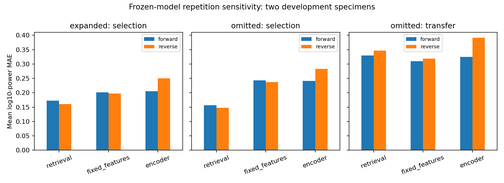

# Frozen repetition reversal and residual review — 10 October 2026

The encoder's development log-power errors worsen when the support and query repetitions are reversed. The direction-versus-repeat contrast also changes sign. Keep the existing models, finite 120 policy, QC and features; carry both orientations into the next matched development review. These observations do not establish a preferred probe or a scientific test result.

## Fixed experiment and access

The [prespecified review](../configs/repetition_review.json) restores all five original baseline fits and all six checkpoints available by 120 from the [controlled extension](convergence_review_report.md). No fitting, new selection, scaler update, download or reserved specimen access occurs. The original familiar and omitted experiments still have different query grids and cannot isolate the effect of omitting speeds.

- Validation specimens remain **10 and 57**, in two provisional groups. All 120 expanded and 300 omitted episodes per orientation remain present: five protocols × three durations × two specimens × four familiar or ten omitted query conditions. The omitted experiment retains six known-speed selection and four transfer conditions.
- Forward: supports follow the original protocol; targets use repeat 1. Reverse: single/speed/load/direction supports swap repeat 0 to repeat 1; targets use repeat 0 at the identical condition and half-second duration.
- The repeat control keeps both reference supports in canonical `[0,1]` order in both orientations. Swapping their order would introduce an avoidable mismatch with the frozen retrieval library, and there is no third repeat. Contact-time and nominal-distance budgets remain identical.
- Baseline coefficients/libraries and encoder checkpoints are frozen and hashed before complementary signal access. All **22 forward prediction arrays reproduce exactly**. Original retrieval fingerprints remain based on the original training supports; the library is not refitted to reverse observations.
- Frozen QC intervals supply 88 complementary windows: 38 expanded and 50 omitted. All pass the complete-cohort rule, with at least 0.0405 logged seconds remaining after the longest requested end. All 88 are bit-for-bit invariant to outside-window acceleration perturbations. No cell is silently excluded.
- A feature whitelist blocks query targets during prediction, including cached targets. Reverse predictions are saved before scoring-target access. Raw inventory hashes, historical manifests/software, scaler and checkpoint identities are checked.

Timing remains scoped to `logged_coordinates_v1`, with retrospective onset/QC and an unverified physical acquisition clock. Two repeatedly inspected groups do not establish manufacturing-family generalization. The twenty reserved specimens remain untouched.

## Primary single half-second results

These are mean query errors within specimen, then mean initialization seeds within specimen, then equal-specimen means. All 15 protocol/duration cells and all methods are in the [summary](repetition_review_summary.csv).

| Development domain | Method | Forward log-power MAE | Reverse log-power MAE | Forward / reverse modeled-band RMS error |
| --- | --- | ---: | ---: | ---: |
| Familiar selection | Retrieval | 0.172648 | **0.160278** | 0.120226 / 0.140988 |
| Familiar selection | Fixed features | 0.201606 | 0.197000 | 0.213699 / 0.183317 |
| Familiar selection | Encoder by 120 | 0.204909 | 0.249970 | 0.224765 / 0.167820 |
| Omitted known-speed selection | Retrieval | 0.156301 | **0.147345** | 0.094997 / 0.108284 |
| Omitted known-speed selection | Fixed features | 0.242826 | 0.237387 | 0.344378 / 0.365632 |
| Omitted known-speed selection | Encoder by 120 | 0.241005 | 0.282608 | 0.355614 / 0.308387 |
| Omitted-speed transfer | Retrieval | 0.329951 | 0.346163 | 0.759809 / 0.638582 |
| Omitted-speed transfer | Fixed features | **0.309587** | **0.318676** | 0.835540 / 0.725713 |
| Omitted-speed transfer | Encoder by 120 | 0.324545 | 0.391170 | 0.803408 / 0.565845 |

Encoder MAE worsens by 0.045060 familiar, 0.041603 known-speed selection and 0.066626 transfer. Modeled-band RMS error improves in all three encoder cells. Preserve both metrics: agreement on total energy is compatible with worse spectral-power agreement. Both support and target recordings change, so this review cannot attribute the change solely to support sensitivity. Target-repeat MAE is 0.127922 in familiar and 0.122715 across the omitted query grid; these are limited repeatability context, not sensor noise floors or prediction ceilings.

Wrong-support encoder MAE remains worse in both orientations: familiar 0.567925 / 0.574441 and omitted transfer 0.531298 / 0.549957. This supports development conditioning sensitivity, without establishing an intrinsic material law or robust held-out benefit.

## Matched-budget direction versus repeat

The declared two-contact contrast uses two half-second supports and identical query conditions. Positive `repeat MAE − direction MAE` favors direction; negative favors repeating the reference contact. [All method contrasts](repetition_review_contrasts.csv) include descriptive two-group bootstrap intervals, which must not be read as population-level significance or multiplicity-adjusted evidence.

| Encoder domain | Forward repeat minus direction | Reverse repeat minus direction |
| --- | ---: | ---: |
| Familiar selection | +0.002897 | −0.032019 |
| Omitted known-speed selection | +0.021018 | −0.006808 |
| Omitted-speed transfer | +0.017922 | −0.009765 |

All three encoder contrasts change sign. The reversal version favors repetition; the forward version favors direction. Retrieval chooses the same training specimen for direction and repetition in these half-second cells, so its contrast is zero. Fixed-feature contrasts are also exported. Do not select the favorable orientation, change the primary probe, or claim a stable direction benefit from this cohort.

## Specimen, condition and retrieval review

The [specimen table](repetition_review_per_surface.csv) and [condition residuals](repetition_review_residuals.csv) retain every cell, method, orientation and nominal query triple, averaging seeds within each specimen.

- Specimen 10 accounts for the larger encoder deterioration. Familiar single-half-second MAE changes 0.208376 → 0.275493, versus 0.201443 → 0.224446 on specimen 57. Transfer changes 0.305040 → 0.422185 on 10, versus 0.344050 → 0.360155 on 57. Both specimens remain included.
- The largest reverse transfer encoder cell is specimen 10 at 50 mm/s, 45°, 1 N: MAE 0.476745, previously 0.342144. Specimen 10 also worsens at the other three transfer triples. This is a descriptive residual, not a new exclusion or tuning criterion.
- Specimen 57 at 50 mm/s and 1 N has much larger absolute modeled-band RMS errors than specimen 10: reverse errors 1.390475 / 1.459681 at 45° / 90°. This helps explain why MAE and total-energy rankings differ. No pooled specimen average should hide it.
- [Retrieval identities](repetition_review_retrieval_identity.csv) remain unchanged in **29 of 30 distinct specimen/protocol/duration cells per experiment**. The only change is specimen 10, load protocol, quarter-second supports: training neighbor 0 → 102. Query-level rows reuse the same fingerprint and are not independent identity changes. The repeat control remains exactly unchanged at the input/library level.

## Decision, verification and artifacts

Retain the original and reverse evidence, all specimens and all query conditions. Do not refit or change architecture, floor, range, QC, training budget or primary protocol from these results. Next audit wider **development selection/transfer** coverage on both repetitions, then implement the declared matched familiar 70-query / omitted 44-query fit pools, with common 44-query known-speed selection and 26-query transfer scoring. Protect the reservation guard and decide practical effects/secondary reporting before a fresh scientific freeze. Locked test evaluation remains unavailable.

The suite passes **92 tests**, including seven new checks for matched reversal identities, complete-cohort failure, target-role/repetition rejection, cached-target blocking, equal-specimen/seed residual aggregation, persisted baseline restoration/interpolation and reservation preflight. Compilation and the numerical release audit also pass.

Run from the project root with `.venv/Scripts/python.exe scripts/review_repetition.py`. It requires the preserved historical roots and completed `runs/convergence_120`; an existing output root is rejected. Use a new declared root for another execution. Private raw/features/checkpoints/predictions remain ignored; public aggregate tables and hashes support review.

Evidence: [configuration](../configs/repetition_review.json), [runner](../scripts/review_repetition.py), [reversal/restoration/access module](../src/tactile_contact/repetition_review.py), [provenance](repetition_review_provenance.json), [window audit](repetition_review_windows.csv), [exact reproduction](repetition_review_reproduction.csv), [tests](../tests/test_repetition_review.py), and [release verifier](../scripts/validate_repetition_review.py).
