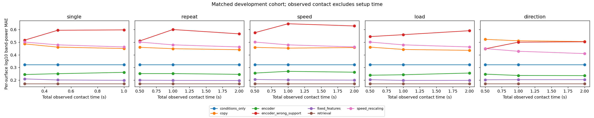
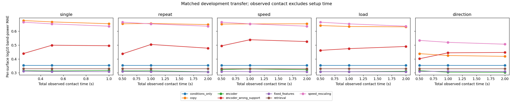

# Raw-window boundary correction — 9 October 2026

Acceleration is now cropped to the declared half-open raw interval before interpolation and anti-alias filtering. The local grid rate uses only allowed timestamps. Interpolation holds local endpoints and polyphase filtering extends a line derived from those local endpoints; no observed signal context is borrowed. Raw prefixes nest, while independently processed edges may differ. This fixes the acceleration information boundary with retrospective starts/QC held fixed; it does not establish causal onset detection or a calibrated acquisition clock.

The source suite passed 53 tests, including nine new boundary checks, and compilation. The audit perturbed outside acceleration in all **688** prepared windows (support and query) across three real reruns. Every processed array was bit-for-bit invariant; recomputed features matched their caches. Exact processing dependencies, padding, rate factors and counts are saved in [window audit](window_boundary_audit.csv). Window IDs, raw intervals, canonical coordinates, episode inputs and scientific configurations match historical runs, and original recording hashes were verified.

All five baselines, three encoder seeds and wrong-support predictions were freshly generated in isolated output roots. Historical outputs remain intact. Before/after feature changes include both local edge treatment and estimating the interpolation rate locally; they do not isolate either mechanism. Refitted score changes also include altered query targets and checkpoint selection. Historical initial/expanded code versions differ in additional modules, and the initial rerun adds two later baselines; see changed modules in provenance. The omitted-speed package differs only in window preparation and its pipeline/timing provenance. Do not attribute every score change solely to previously borrowed acceleration.

## Primary development comparison

Single 0.5-second support; seed means within specimen, then equal specimen means. Omitted rows use transfer; the other rows use selection. Grids differ between experiments and still involve only two development validation specimens.

| Experiment | Method | Historical MAE | Bounded MAE |
| --- | --- | ---: | ---: |
| initial | retrieval | 0.1724 | 0.1726 |
| initial | fixed_features | Not previously fitted | 0.2070 |
| initial | encoder | 0.7910 | 0.7758 |
| initial | encoder_wrong_support | 0.7758 | 0.7676 |
| expanded | retrieval | 0.1724 | 0.1726 |
| expanded | fixed_features | 0.2006 | 0.2016 |
| expanded | encoder | 0.2492 | 0.2513 |
| expanded | encoder_wrong_support | 0.5837 | 0.5936 |
| omitted | retrieval | 0.3298 | 0.3300 |
| omitted | fixed_features | 0.3098 | 0.3096 |
| omitted | encoder | 0.3158 | 0.3141 |
| omitted | encoder_wrong_support | 0.4975 | 0.4994 |

Retrieval still leads the expanded familiar-condition pilot; fixed-feature regression still has the lowest omitted-speed log-power MAE. Retrieval retains the lowest omitted-speed modeled-band RMS error among these three methods. Retrieval-minus-encoder transfer MAE is 0.0158, with a two-group diagnostic interval [-0.0027, 0.0343]; it spans zero. No learned-model superiority, preferred scientific probe or fresh-test result is established.

## Feature and clock effects

| Run | Median per-window mean log-feature change | Maximum per-window mean change |
| --- | ---: | ---: |
| initial | 0.003756 | 0.008395 |
| expanded | 0.003827 | 0.011601 |
| omitted | 0.003907 | 0.011601 |

These are log10 band-power feature differences, not force errors or calibrated physical time. Duration/role/split breakdowns are in [feature changes](window_boundary_feature_changes.csv). Timing remains consequential: the bounded expanded and omitted runs retain median nominal-index/logged-duration ratios of 1.4388 and 1.44; corresponding median log-feature clock differences are 0.3523 and 0.3914. The paths assign different nominal durations and frequency coordinates, so sensitivity does not choose the correct clock.

## Reproduction and remaining gates

Run the commands in the [README](../README.md), then `python scripts/summarize_window_boundary.py` with the environment interpreter from the repository root. The before/after audit requires the three retained historical local roots as well as their corrected reruns; a clean clone can reproduce corrected runs but needs reconstructed historical runs to regenerate this comparison. The report audits matching manifests, raw-file hashes, interval dependencies, cache reconstruction, raw nesting and all 120 omitted-speed retrieval endpoint/weight records. The initial historical manifest lacked raw indices, which this audit derives from its preserved window coordinates and the verified original timestamps. Transfer labels remain excluded until every method/checkpoint is selected.

Aggregate matrices: [initial](bounded_initial_summary.csv), [expanded](bounded_expanded_summary.csv), [omitted](bounded_omitted_summary.csv); [primary before/after scores](window_boundary_primary.csv); [run and audit provenance](window_boundary_provenance.json). Raw data, full predictions and checkpoints remain local/ignored; release reconstruction still needs the documented dataset and environment.

Next: investigate clock evidence or freeze an explicit logged-coordinate claim, review motion/heading/load and coverage, maintain the exposure ledger, quantify repeatability/convergence and run a matched-grid familiar/omitted development comparator. All twelve current specimens remain development-exposed. A fresh locked scientific test is unimplemented, and mechanics requires independently calibrated force measurements.
